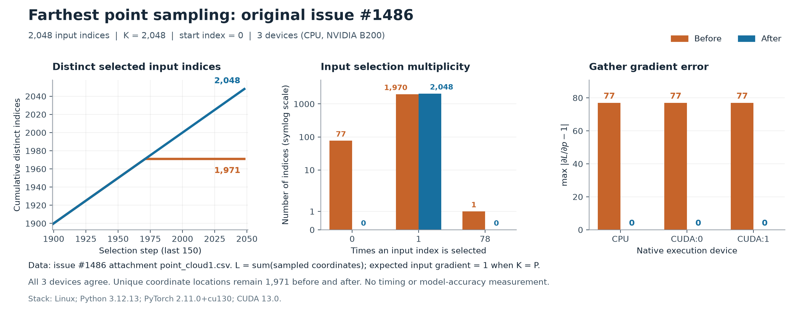

# Evidence for PR #2055

[Fix duplicate indices in farthest point sampling](https://github.com/facebookresearch/pytorch3d/pull/2055)
addresses [issue #1486](https://github.com/facebookresearch/pytorch3d/issues/1486).

## Original issue: measured before and after

The input is the original [issue attachment](https://github.com/facebookresearch/pytorch3d/files/11039116/point_cloud1.csv),
with 2048 input rows and 1971 distinct coordinate positions. Sampling uses
`K=2048`, float32 coordinates, and the default starting index 0. Every input
index should therefore appear exactly once, including indices with coincident
coordinates.

| Metric | Before | After |
| --- | ---: | ---: |
| Distinct sampled input indices | 1971 | 2048 |
| Repeated selections beyond the first occurrence | 77 | 0 |
| Input indices omitted | 77 | 0 |
| Selection count of input index 0 | 78 | 1 |
| Input indices selected exactly once | 1970 | 2048 |
| Maximum absolute gather-gradient error | 77 | 0 |
| Gather-gradient RMSE | 1.712488595 | 0 |
| Distinct sampled coordinate positions | 1971 | 1971 |

Each result was measured with the actual native extension on CPU, CUDA:0, and
CUDA:1. All three devices produce the same metrics. The numerical gradient
check uses `loss = sampled_points.sum()`: with `K=P` and every input selected
once, the expected derivative of this gathered-coordinate loss with respect
to every input coordinate is 1. This checks gather and backward behavior;
the discrete FPS index-selection operation is not differentiated.



The figure uses the measured selection indices and gradients. It shows index
coverage and repeated selection, rather than spatial coverage: coincident input
rows occupy the same positions, so a plain 3D point-cloud overlay would obscure
this bug. Both outputs cover the same 1971 distinct coordinate positions.

- [Six device-specific numerical results](numerical-results.csv)
- [Per-input selection counts and gradients](per-input-results.csv)
- [Vector figure](fps-comparison.svg)
- [Capture and plotting script](fps_original_issue_evidence.py)

## Supplementary validation

[The validation matrix](validation-matrix.csv) contains 165 measured records:
162 passes and 3 reproductions of the original defect on the baseline.

| Scenario | Records | Result |
| --- | ---: | --- |
| Original CSV, before and after, on three devices | 6 | Baseline defect reproduced on all three; fix passes on all three |
| 24 point counts, two coordinate patterns, three devices | 144 | Native forward, gather, padding, and weighted backward pass |
| Cow OBJ loaded from disk, appended duplicate vertices and padding, three devices | 3 | Component end-to-end forward and backward pass |
| Invalid K/lengths batch dimensions, two implementations, three devices | 12 | Expected errors raised |

The point counts are 8, 9, 15, 16, 17, 31, 32, 33, 63, 64, 65, 127, 128,
129, 255, 256, 257, 511, 512, 513, 1023, 1024, 1025, and 2048. The patterns
are all-coincident points and partially duplicated coordinates. The OBJ path is
`docs/tutorials/data/cow_mesh/cow.obj` in the PyTorch3D source checkout.

The permanent regression tests are in
[`tests/test_sample_farthest_points.py`](https://github.com/fusheng-ji/pytorch3d/blob/45f9132748ee1cac04e87bc7783b570b8022ae5c/tests/test_sample_farthest_points.py).
All 28 new regression subcases fail on the baseline and pass after the fix.
The FPS module and ops utility tests pass (11 tests); Compute Sanitizer reports
zero errors for the five added regression methods.

## Revisions and environment

- Before: `88e182f989c80836f4bd744e0d9cb1852762ce01`
- After: `45f9132748ee1cac04e87bc7783b570b8022ae5c`
- Linux; Python 3.12.13; PyTorch 2.11.0+cu130; CUDA 13.0.
- Two NVIDIA B200 GPUs. They are the same GPU model, rather than two hardware
  architectures.

The artifacts contain selection indices, gradients, summary values, and
environment metadata. Native binaries and the original attachment are not
redistributed here. The source URL is recorded so the input can be fetched
from the original issue.

## Reproduce the results

Build the complete native extension in two separate source checkouts at the
listed revisions, following [INSTALL.md](https://github.com/facebookresearch/pytorch3d/blob/88e182f989c80836f4bd744e0d9cb1852762ce01/INSTALL.md).
Use the same Python/PyTorch/CUDA environment for both builds. The paths below
are placeholders for those independently built checkouts. Run each capture
in a fresh process so the baseline and patched extensions are never mixed.

From this directory, download the original CSV and capture both builds:

```bash
curl -L https://github.com/facebookresearch/pytorch3d/files/11039116/point_cloud1.csv -o point_cloud1.csv

python fps_original_issue_evidence.py capture \
  --input point_cloud1.csv --output-dir reproduced --label before \
  --repo-root /path/to/pytorch3d-baseline \
  --source-revision 88e182f989c80836f4bd744e0d9cb1852762ce01 \
  --devices cpu cuda:0 cuda:1

python fps_original_issue_evidence.py capture \
  --input point_cloud1.csv --output-dir reproduced --label after \
  --repo-root /path/to/pytorch3d-patched \
  --source-revision 45f9132748ee1cac04e87bc7783b570b8022ae5c \
  --devices cpu cuda:0 cuda:1

python fps_original_issue_evidence.py plot \
  --capture-dir reproduced --output-dir reproduced
```

Use `--devices cpu` for an explicitly smaller CPU-only reproduction. `plot`
requires NumPy and Matplotlib, and reads the saved captures without importing
PyTorch or running native kernels. Each JSON capture records the original input
checksum, source revision, native extension checksum, and captured-array checksum.
All raw captures are included so the figures and tables can also be regenerated
directly from the published measurements.

To reproduce the supplementary matrix, supply the independently built baseline
extension and the patched checkout:

```bash
python reproduce_validation_matrix.py \
  --repo-root /path/to/pytorch3d-patched --output-dir reproduced-matrix \
  --baseline-extension /path/to/pytorch3d-baseline/pytorch3d/_C.cpython-312-x86_64-linux-gnu.so
```

This uses CPU and both CUDA devices by default (165 records), and fetches the
original attachment if no `--original-csv` is supplied. For one GPU use
`--devices cpu cuda:0`; for CPU only use `--devices cpu` (55 records). The
extension filename depends on the Python version and platform. A CPU-only run
of this portable script has also passed all 55 cases (54 passes and one baseline
defect reproduction); it does not replace the published three-device matrix.

## Verification limits

The full repository suite reported 784 tests with 1 failure, 36 errors, and
1 skip. Optional dependencies are missing; CPU IoU numerical tolerance failures
and the Pulsar image-write error also occur on the baseline. The full repository
linter stops at its legacy `usort` invocation with the installed CLI. Checks on
the four changed files pass. No full-suite or complete-linter pass is claimed.

These measurements cover one software stack. No downstream model training,
model-accuracy improvement, spatial-coverage improvement, or comprehensive
performance benchmark is claimed.
